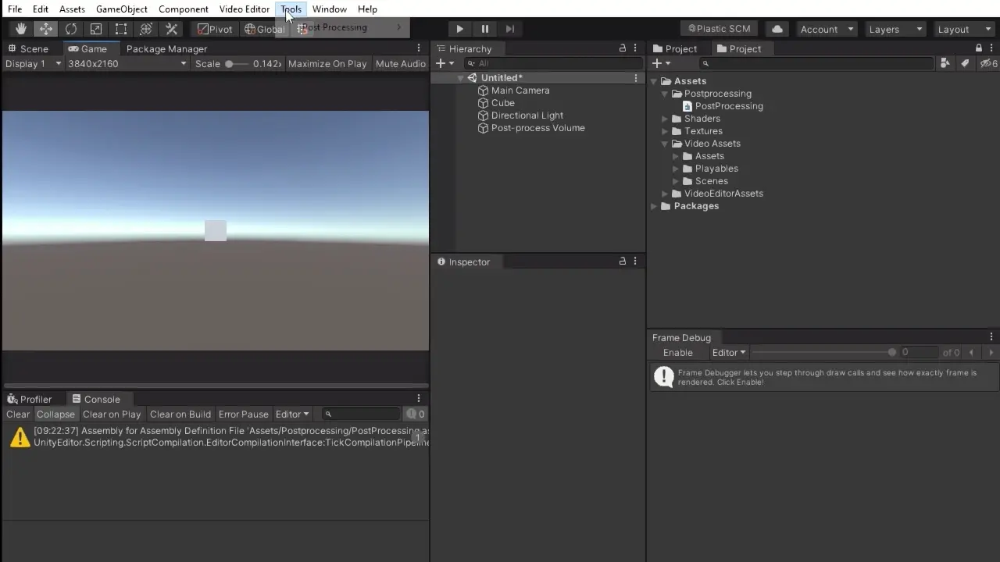

# Custom PostFX Template Spawner
    


 

A productivity Editor tool that creates all required boilerplate for custom Post-Processing Stack V3 Effects with a single click.



## Installation 
### Package manifest
* Add the following to your manifest.json:

```"com.parkinglotgames.custom-postfx-template-spawner": "1.1.0"```

### Git URL
* In Unity, go to Window > Package Manager > "+" button > "Add package from git URL..." and enter:

```https://github.com/ParkingLotGames/Unity-Custom-PostFX-Template-Spawner.git```

# //TODO

#### Add documentation.
#### Add Custom Renderer Features Support.
